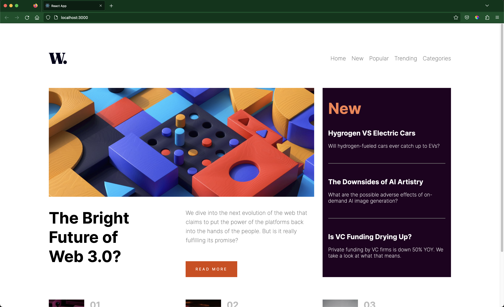

# Frontend Mentor - News homepage solution

This is a solution to the [News homepage challenge on Frontend Mentor](https://www.frontendmentor.io/challenges/news-homepage-H6SWTa1MFl). Frontend Mentor challenges help you improve your coding skills by building realistic projects.

## Table of contents

-   [Overview](#overview)
    -   [The challenge](#the-challenge)
    -   [Screenshot](#screenshot)
    -   [Links](#links)
-   [My process](#my-process)
    -   [Built with](#built-with)
    -   [What I learned](#what-i-learned)
    -   [Continued development](#continued-development)
    -   [Useful resources](#useful-resources)
-   [Author](#author)
-   [Acknowledgments](#acknowledgments)

## Overview

### The challenge

Users should be able to:

-   View the optimal layout for the interface depending on their device's screen size
-   See hover and focus states for all interactive elements on the page

### Screenshot

### Links

-   Solution URL: [Add solution URL here](https://your-solution-url.com)
-   Live Site URL: [https://news-homepage-fm-one.vercel.app/](https://news-homepage-fm-one.vercel.app/)

## My process

I decided to tackle this project with a mobile first approach. I took it one section at a time, building out each section firstly in a mobile view, then adjusting the styles as necessary for the desktop view. This approach made it a lot less confusing when trying to figure out what styles were needed for specific viewports and which styles could be shared across all viewports.

Matching the colors to the design proved to be a little difficult, however, I tried to get them as close as I could to what I thought was the original.

### Built with

-   [React](https://reactjs.org/) - JS library
-   [SASS](https://sass-lang.com/) - CSS PreProcessor

### What I learned

One major thing I learned during this project, is the power of mobile first development. It's something I learnt while in school but never actually applied to my projects. My excuse was always "I forgot" or "it's not that important". Only to find that after styling for desktop my projects were extremely hard to make responsive so I would just give up.

On top of how important mobile first styling is, I learned that CSS is capable of a lot more than I originally gave it credit for. I was able to give different functionality to the nav menu based on the viewport using only css and classnames. It seems so simple now, but in previous projects, my first instinct was to always attempt this different functionality through javascript, which always turned into a big jumble of logic that would just get confusing. This project put into perspective how I have been thinking past projects through and how much more difficult I have made them for myself.

### Continued development

In future projects, I want to get better at working with images. I still have trouble sometimes understanding how images work and how to make them work the way I want. I think getting a better grasp of images will be a big step for me and a huge advantage with future projects.

## Author

-   Frontend Mentor - [@shelton-rolle](https://www.frontendmentor.io/profile/Shelton-Rolle)
